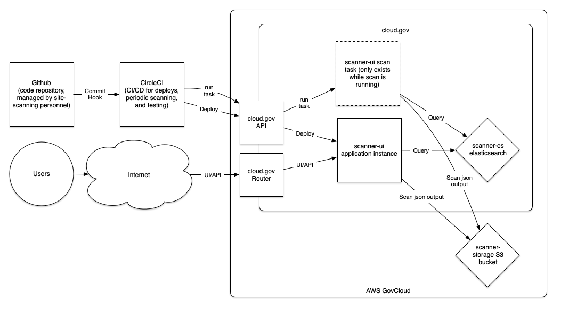

# Architecture

There are three components to this project:
- *The Scanning Engine:*  This engine, when executed, will run all the configured scans 
  against all of the configured domains and generate json output.
- *Scanning Engine Plugins:*  These will be plugins that will let you execute different
  types of scans.  They will be used by the scanning engine, or can be executed by hand.
  It is anticipated that over time, more plugins will be created to expand the functionality
  of the scanning engine.
- *Scan Result UI:*  This is a web frontend that also implements a REST API to download/search
  scan results.




## Continuous Deployment

The components are deployed using CircleCI into cloud.gov and once a day, the scanning engine is
executed using https://docs.cloudfoundry.org/devguide/using-tasks.html#run-tasks, generating
it's json files into S3.  The UI then can be used to find and download the scan results.


## Scan API

The scan API map is:
  - `/api/v1/domains/` enumerates all of the scans for all domains.
  - `/api/v1/domains/{domain}` pulls down all of the scan results for a particular domain.
  - `/api/v1/scans/` enumerates all of the scantypes.
  - `/api/v1/scans/{scantype}` enumerates all of the scans for all domains that have this scantype.
  - All of the above can have search queries added to them.
    You can query on any field that you can see in the API.  Subfields are accessed
    with `.`, like `data.dap_detected`, for example.  If you have multiple queries,
    they will be ANDed together:
    - `/api/v1/domains/?domain=gsa*`
    - `/api/v1/domains/?domain=gsa*&data.status_code=200`
    - `/api/v1/domains/18f.gov/?data.status_code=200`
    - `/api/v1/scans/uswds/?data.total_score=gt:100`
    - `/api/v1/scans/uswds/?data.total_score=lt:50`
  - You can also request pagination by adding a `page=1` parameter to any of the above queries,
    which will give you a request back that has next/previous links and a page number count.  So
    `/api/v1/domains/?page=1` will give you the first 100 entries and `/api/v1/domains/?page=2`
    will give you the next 100, for example.

  - `/api/v1/lists/dates/` enumerates all of the snapshots of scan data that we have.
  - `/api/v1/lists/{scantype}/agencies/` enumerates all of the agencies that are in the scantype.
  - `/api/v1/lists/{scantype}/domaintypes/` enumerates all of the domaintypes that are in the scantype.
  - `/api/v1/lists/{scantype}/values/{field}/` enumerates the unique values contained in the specified field in the given scantype.  The field can be specified with nested fields, like `data.dap_detected` if need be.
    - `/api/v1/lists/{scantype}/values/{field}/{subfield}/` enumerates the unique values in the subfield field in all of the dictionaries under the specified field.  This is so you can query things like `/api/v1/lists/pagedata/values/data/responsecode` to get all the response codes for all of the pages under the data field in the pagedata scantype.
  - `/api/v1/date/{date}/...` will let you query the index for the specified date.  The `{date}`
    can be found with the `/api/v1/lists/dates/` API endpoint, and after that, you can append on the
    normal domains, scans, and list endpoint queries, like
    `/api/v1/date/2020-01-27/domains/18f.gov/`.  If you give a bad date, it will use the latest
    scans rather than returning an error.

The API returns metadata about the scans that we have, as well as a reference to where the scans are actually
stored.  In addition, if you go to the `/api/v1/domains/{domain}` endpoint, you will get the scan results inline
too.  For example:
```
$ curl -s https://APPNAME.app.cloud.gov/api/v1/domains/18f.gov/ | jq -r .
[
  {
    "domain": "18f.gov",
    "scantype": "200scanner",
    "data": {
      "/": "200",
      "/code.json": "404",
      "/data": "404",
      "/data.json": "404",
      "/developer": "200",
      "/digitalstrategy/": "404",
      "/open": "404",
      "/privacy": "404",
      "/robots.txt": "200",
      "/sitemap.xml": "200"
    },
    "scan_data_url": "https://s3-us-gov-west-1.amazonaws.com/BUCKETNAME/200scanner/18f.gov.json",
    "lastmodified": "2019-07-02T23:43:37Z"
  },
  {
    "domain": "18f.gov",
    "scantype": "uswds2",
    "data": {
      "domain": "18f.gov",
      "flag_detected": 0,
      "flagincss_detected": 0,
      "grid_detected": 0,
      "merriweatherfont_detected": 23,
      "publicsansfont_detected": 0,
      "sourcesansfont_detected": 20,
      "status_code": 200,
      "total_score": 125,
      "usa_classes_detected": 26,
      "usa_detected": 53,
      "uswds_detected": 3,
      "uswdsincss_detected": 0
    },
    "scan_data_url": "https://s3-us-gov-west-1.amazonaws.com/BUCKETNAME/uswds2/18f.gov.json",
    "lastmodified": "2019-07-02T23:43:46Z"
  }
]
$ curl -s https://s3-us-gov-west-1.amazonaws.com/BUCKETNAME/200scanner/18f.gov.json | jq -r .
{
  "/": "200",
  "/code.json": "404",
  "/data": "404",
  "/data.json": "404",
  "/developer": "200",
  "/digitalstrategy/": "404",
  "/open": "404",
  "/privacy": "404",
  "/robots.txt": "200",
  "/sitemap.xml": "200"
}
$
```

## Scan Data Storage

The scans are stored on disk as json files named by the domain and placed in a scantype
subdirectory in a public S3 bucket.  The location of the files can be found by querying
the API, like so:
```
$ curl -s https://APPNAME.app.cloud.gov/api/v1/scans/ | jq -r '.[] | .scan_data_url'
https://s3-us-gov-west-1.amazonaws.com/BUCKETNAME/200scanner/18f.gov.json
https://s3-us-gov-west-1.amazonaws.com/BUCKETNAME/200scanner/2020census.gov.json
https://s3-us-gov-west-1.amazonaws.com/BUCKETNAME/200scanner/9-11commission.gov.json
https://s3-us-gov-west-1.amazonaws.com/BUCKETNAME/200scanner/911.gov.json
https://s3-us-gov-west-1.amazonaws.com/BUCKETNAME/200scanner/911commission.gov.json
...
$ 
```
